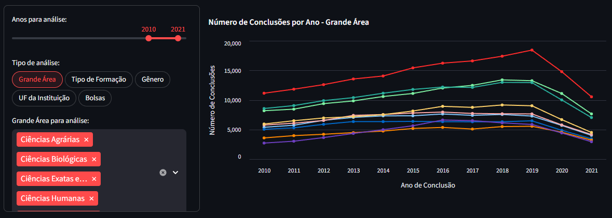

# Análise de Dados da Plataforma Lattes 📚


> O [dashboard](https://lattes-dashboard-9tm0lsqqmgb.streamlit.app/) foi desenvolvido em Python utilizando a biblioteca Streamlit e faz parte do meu portfólio pessoal de Ciência e Análise de Dados.

### Próximos Ajustes
- [x] Tipos de Análise
- [x] Crescimento
- [x] Impacto Pandemia
- [ ] Visualização em Mapa
- [ ] Estudantes de Fora
- [ ] Nova Coleta de Dados

## 🛠️ Tecnologias Utilizadas
- Linguagem: Python 3.x
- Interface: [Stremlit](https://lattes-dashboard-9tm0lsqqmgb.streamlit.app/)
- Manipulação de Dados: Pandas
- Gráficos: Altair
- Ambiente: Docker

## 📈 Principais Insights
- 2020 Representou uma queda de 22% nas formações
- Maior Impacto em 2020: Engenharias (-25.97%)
- Menor Impacto em 2020: Ciências Sociais Aplicadas (-16.29%)

## 🚀 Como Executar o Projeto

1. Instale as dependências

   ```
   $ pip install -r requirements.txt
   ```

2. Execute a aplicação

   ```
   $ streamlit run streamlit_app.py
   ```

## ⚠ Observações sobre os Dados
Os dados foram coletados no início de 2023. Devido à natureza de atualização da Plataforma Lattes (que depende do preenchimento manual pelos pesquisadores), pode haver um "delay" ou distorções em registros muito recentes.
